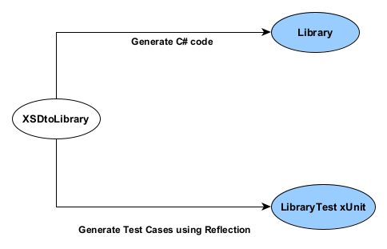
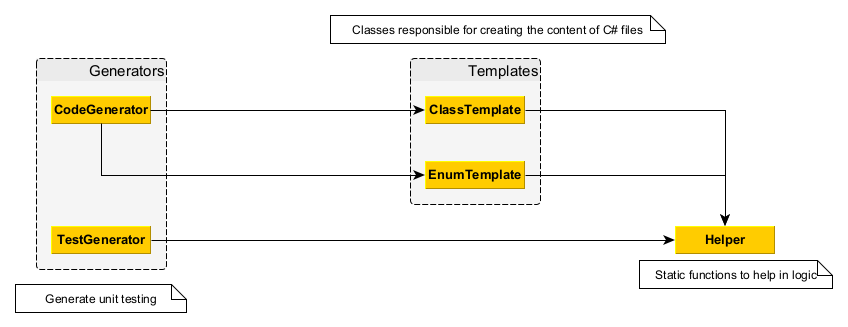
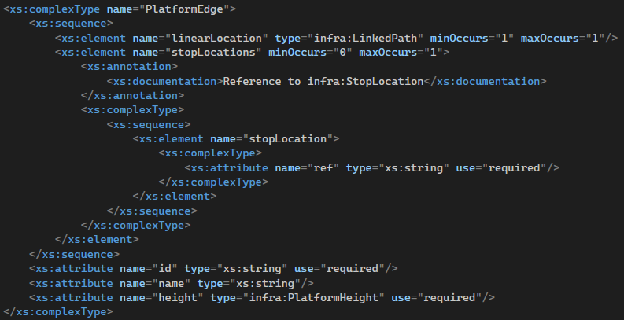
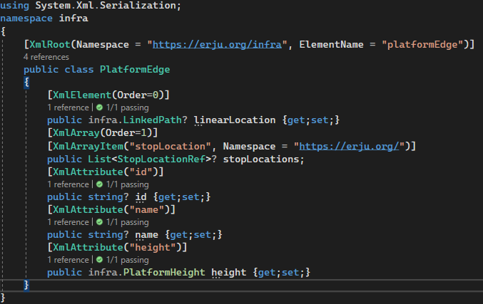
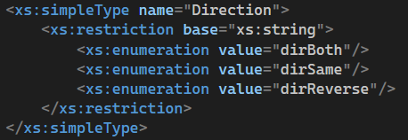
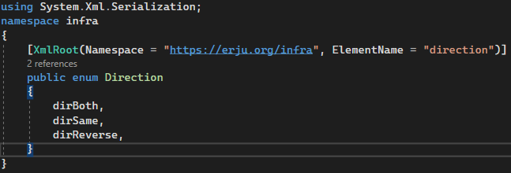
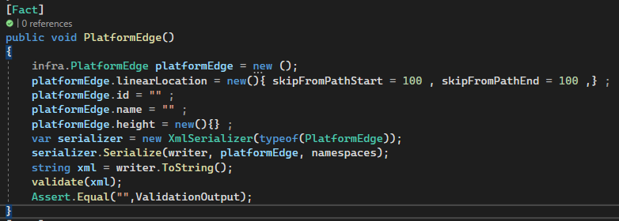

# Content

- **[XSDtoLibrary](#XSDtoLibrary)**
- **[Library](#Library)**
- **[LibraryTest](#LibraryTest)**
- **[Sample output](#Sample)**

  

# XSDtoLibrary
A project to generate C# library code from XSDs and testing cases for confirmation that the library is able to serialize to a valid XML.
The project utilizes Linq queries within logical algorithm to access and generate C# classes and their proeprties.
The project also utilizes Reflection to be able to generate Test cases with combination with the XSDs for specific cases.

  

# Library
A .NET6 library that is able to be serialized into a valid XML to be used in C# environment for manipulating and storing data in a the data model provided in the schemas.

# LibraryTest
xUnit automated testing environment to provide test cases for each generated C# class to validate the generated code ability to serialize to a valid xml components.
Please add the Library dll as a COM reference to the LibraryTest project to run the test cases.
Please make sure that the XSD file are in the debug folder.

# Sample
- 
- 
- 
- 
- 
